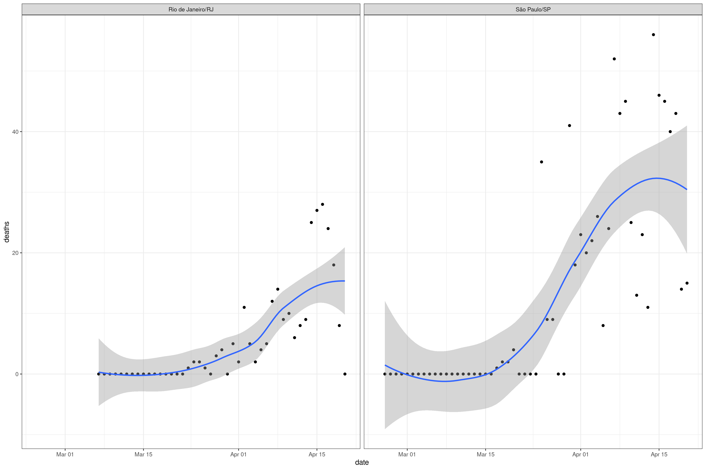
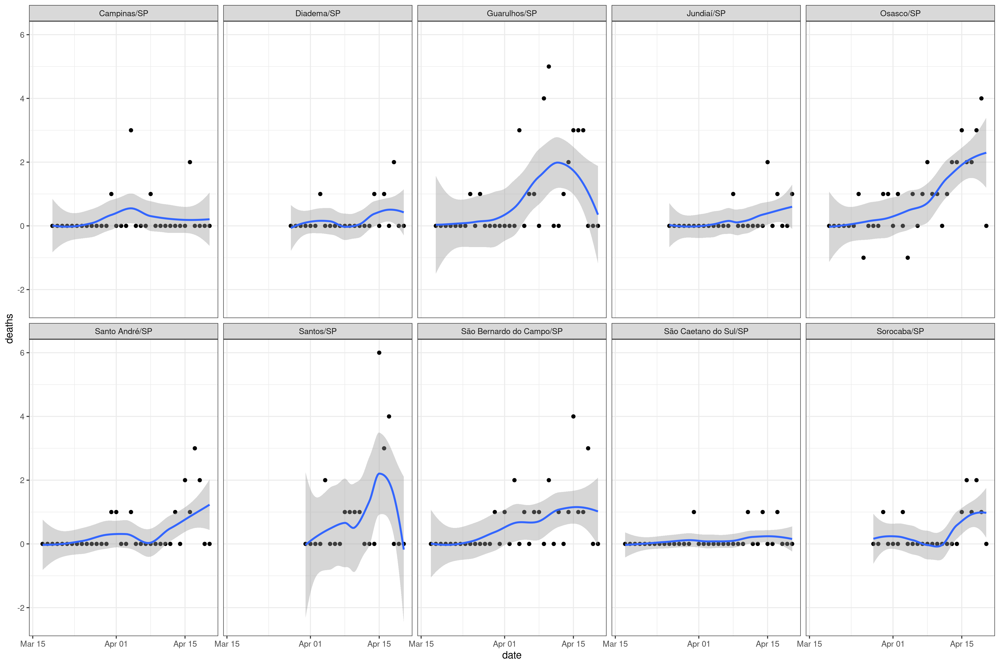

  
## Covid-19 evolution

Goals:

- Track confirmed cases, deaths and mortality rates. 
- Compare numbers from Brazil and other countries.
- Compare numbers from some cities in Brazil.

Data Sources: Johns Hopkins University and Brazilian Ministry of Health

Please, refer to [this dashboard](https://jgassen.shinyapps.io/tidycovid19/) for a "more dynamic" exploratory analysis
        
    
## Confirmed

## Deaths

## Mortality Rate (Deaths / Cases)

## Cities

