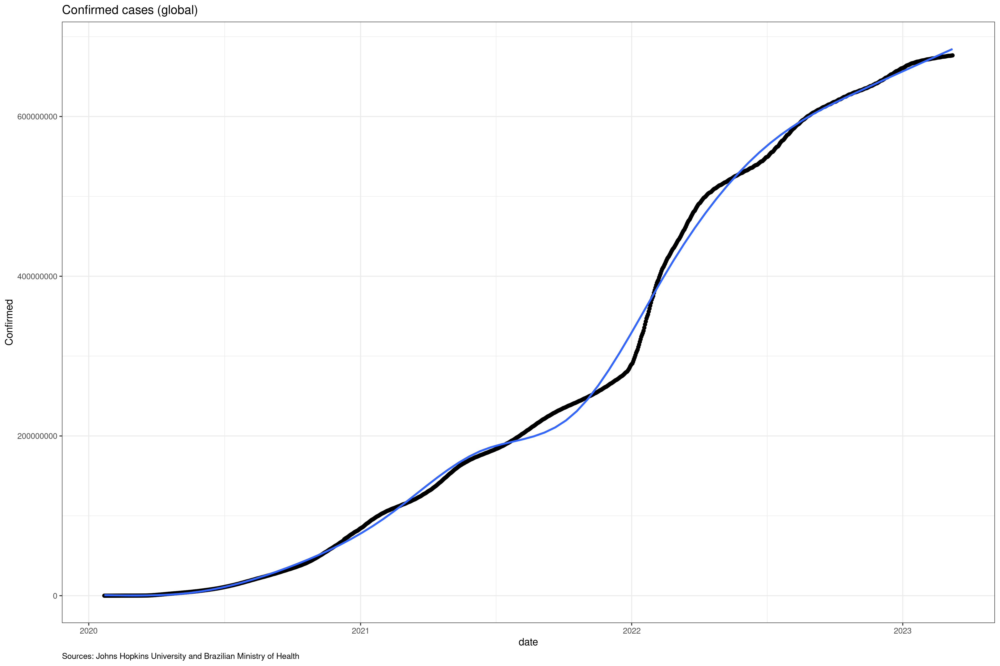
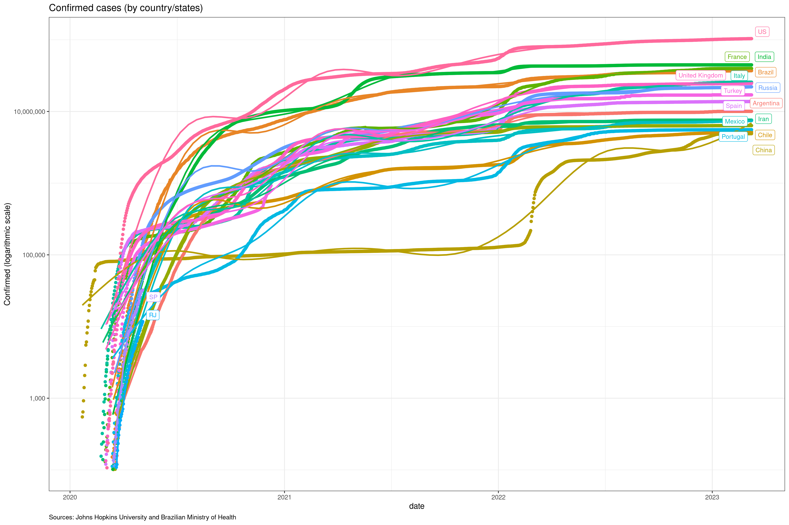
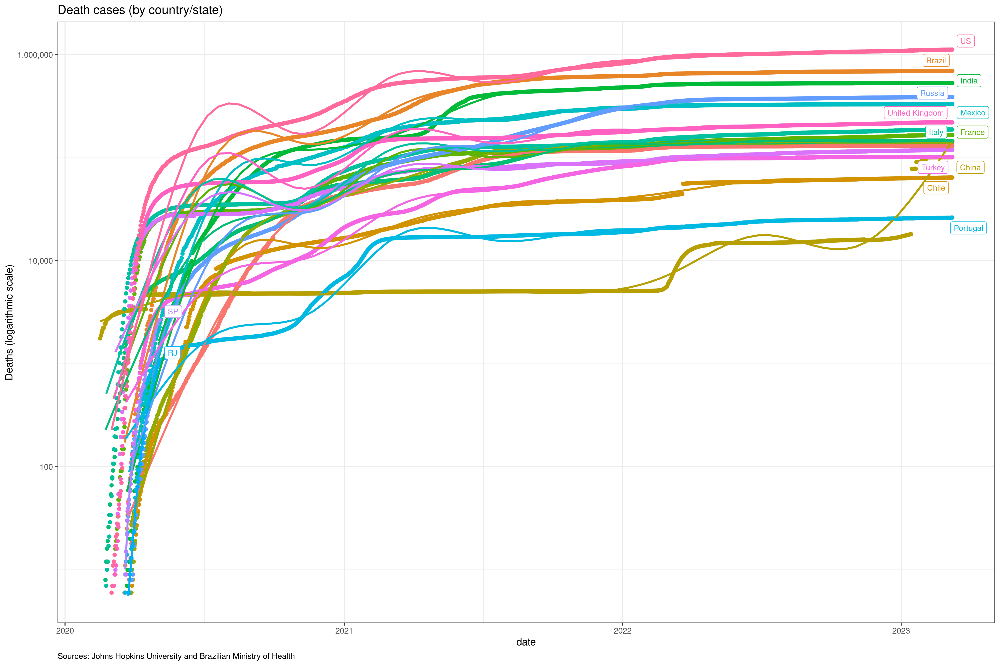
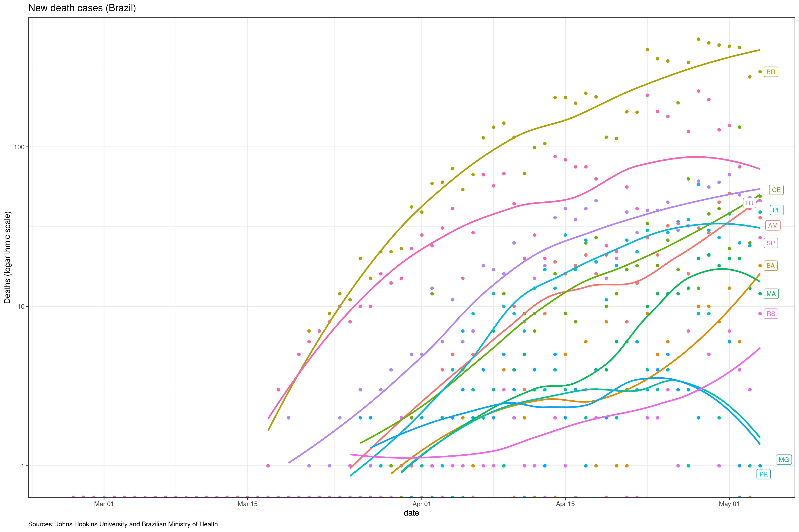
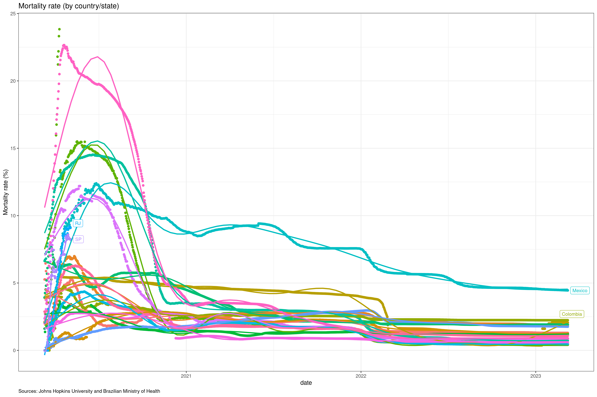

  
## Covid-19 evolution

Goals:

- Track confirmed cases, deaths and mortality rates. 
- Contrast numerical data between Brazil and other countries.
- Contrast numerical data between cities in Brazil.

Data Sources: Johns Hopkins University and Ministério da Saúde do Brasil.

Please, refer to [this dashboard](https://jgassen.shinyapps.io/tidycovid19/) for a "more dynamic" exploratory analysis.
        
    
## Confirmed

## Deaths

## Mortality Rate (Deaths / Cases)

## Cities

