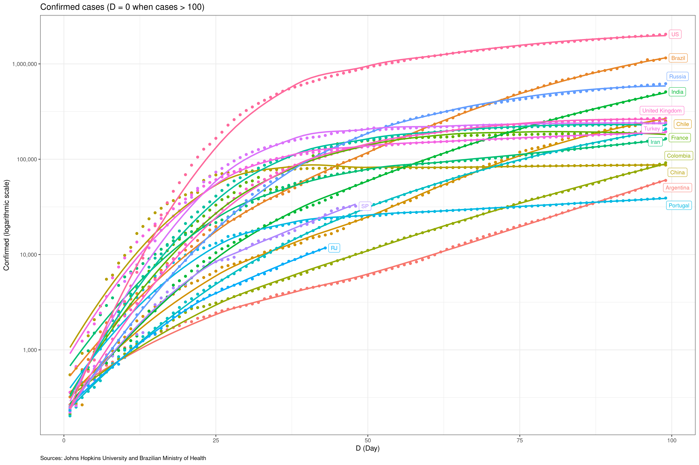
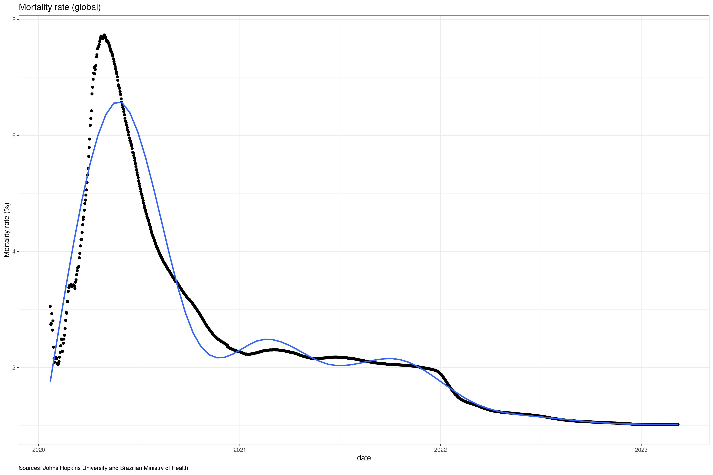

# Goals
 
 - Track Covid-19 evolution (confirmed cases, deaths and mortality rates).
 - Compare relevant countries with brazilian states
 - Data Sources: Johns Hopkins University and Brazilian Ministry of Wealthy"

Last update: 04-08-2020

# Confirmed

 

 

# Deaths

 

 

# Mortality Rate

 

