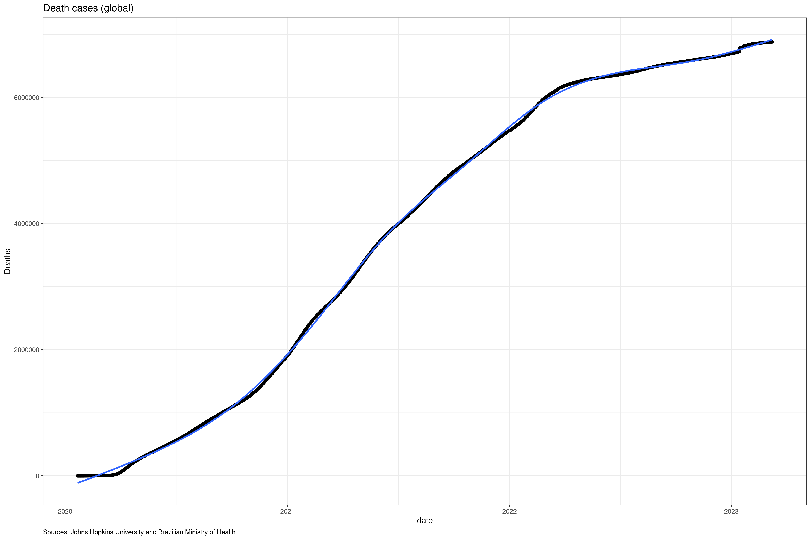
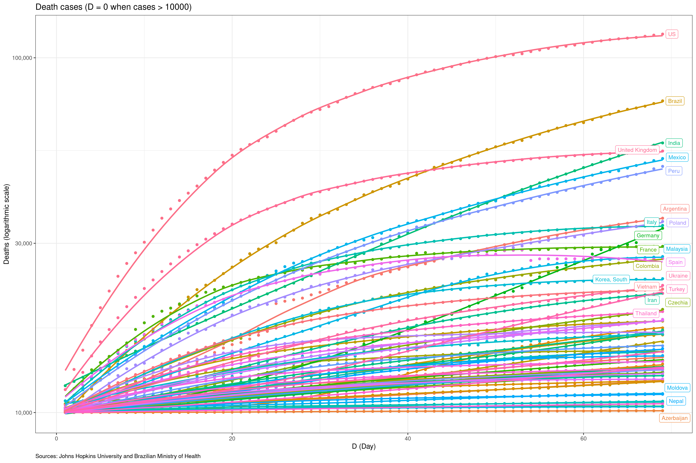
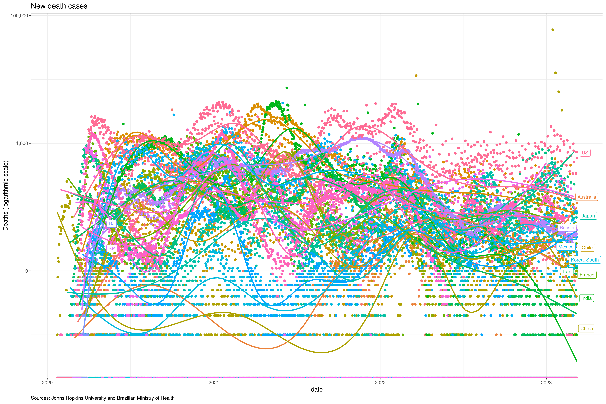
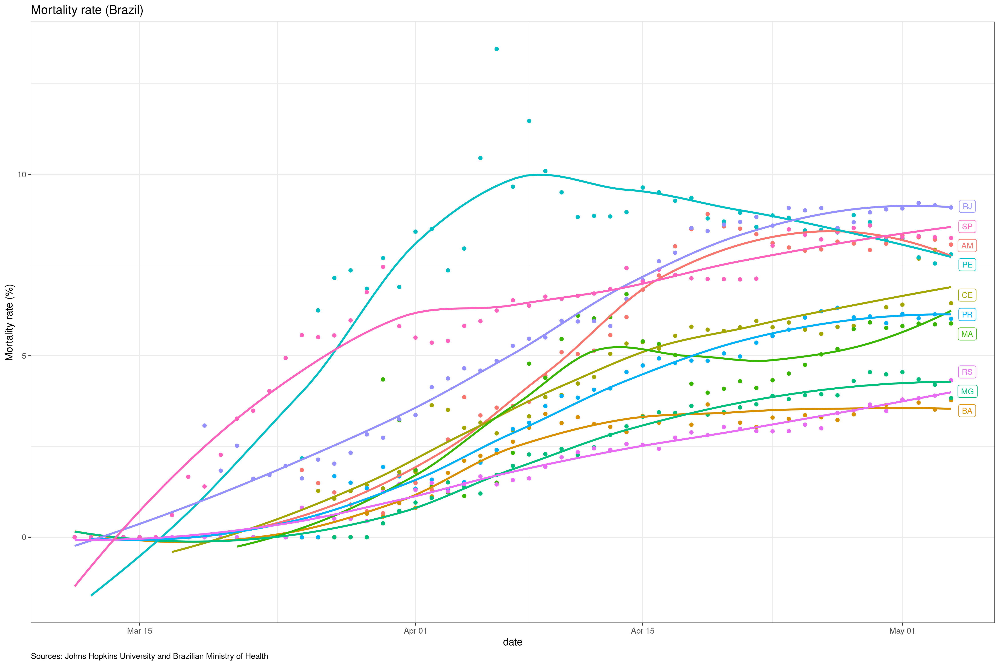

# Goals
  
* Track Covid-19 evolution (confirmed cases, deaths and mortality rates). 

* Compare relevant countries with Brazil and its states

* Compare numbers from Sao Paulo city and surrounding cities.

  

Data Sources: Johns Hopkins University and Brazilian Ministry of Health

Updated until **May 29, 2020**

Please, refer to [this dashboard](https://jgassen.shinyapps.io/tidycovid19/) for a "more dynamic" exploratory analysis
        
    
# Confirmed

 

 

# Deaths

 

 

 

# Mortality Rate (Deaths / Cases)

 

# Cities

 

 
